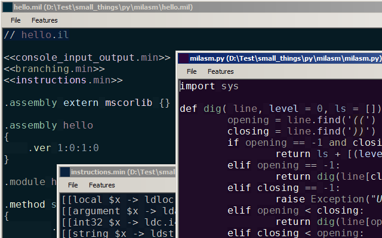
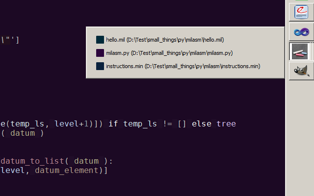
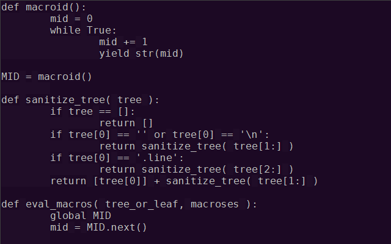
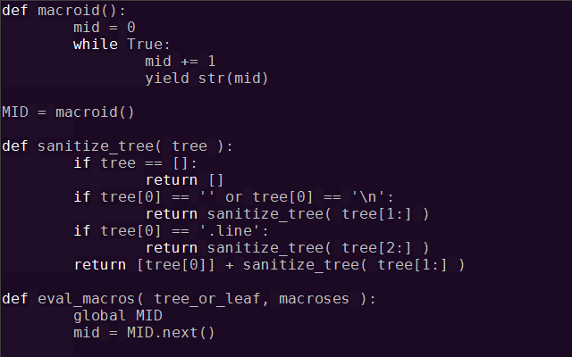
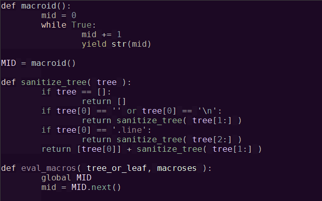
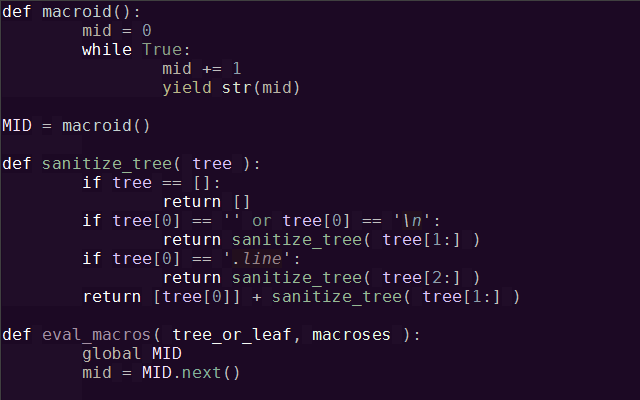
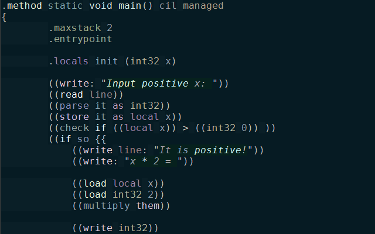
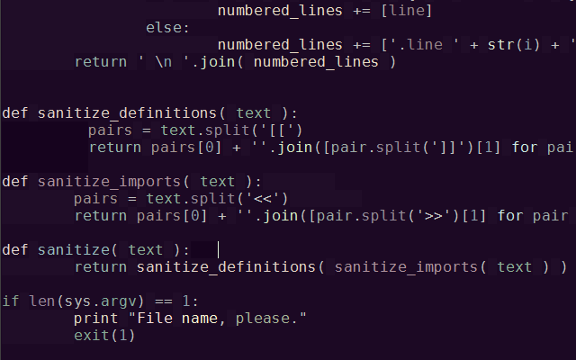
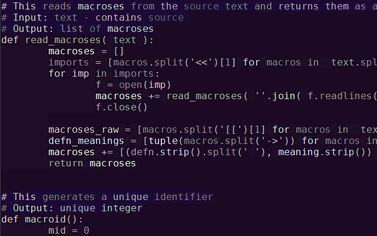
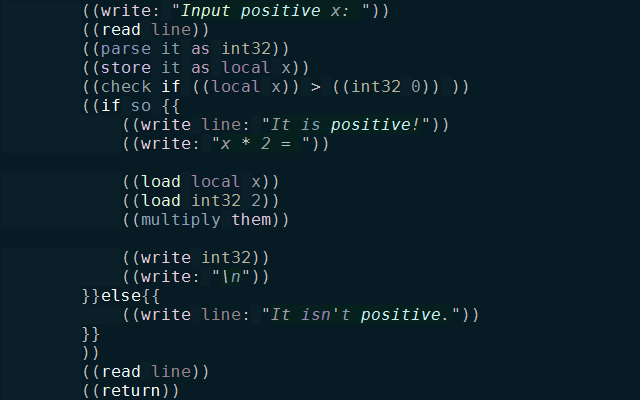

chalks_editor
=============

There are to many text editors for coders. Vim and Emacs are already more then enough, yet there are hundreds of them and even more to come. There must be something appealing in creating your own text editor, otherwise people would just stop making them. And they don't.

So I tried it too and I liked it. Well, actually I didn't do a real editor, instead I wrote a working prototype to test some of the features I don't see in others. My Vim-killer is called Chalks and its main idea is "different things should be visually different". I mostly use colors for that purpose.

First of all, every instance gets its own random background color. So different instances look differently at the very first glance.

Not only that, but also it's own icon made with slightly brightetned background color.

It has both syntax and per-word highlighting. With the later every word has its own unique color, so you wouldn't mistake 'edx' for 'ebx'. Syntax highlighting is orthogonal to the per-word. There is no reason in making `for` and `if` look different, they are very unlikely to be mistaken.

No highlighting.

Syntax highlighting.

Per-word highlighting.

Both.

Per-word highlighting also works wonders with exotic languages you don't have a proper lexer for. 

The other feature is space and tabs indentation. These are definitely different and they should be exposed differently. I use background color for this. On this examples I've put some tabs (darker) and spaces (lighter) where they don't belong just to show you an idea.

Seing tabs and spaces is importrant when writing Python and makefiles, but it is also rather helpful when writing Assembly or even C-like languages.

I'm still experimenting with comments and strings indentation. They should look different from the code, but they should neither catch much attention nor be deemed to escape it. Text outputs and comments are importrant as much as the code, but not more. For now I have this for comments:

And this for strings.

Coloring schemes may vary a lot from iteration to iteration as the whole reason for this project is to explore the concept. Coloring might work better or worth depending on a display or even the lighting around.

You can experiment with it yourself.
